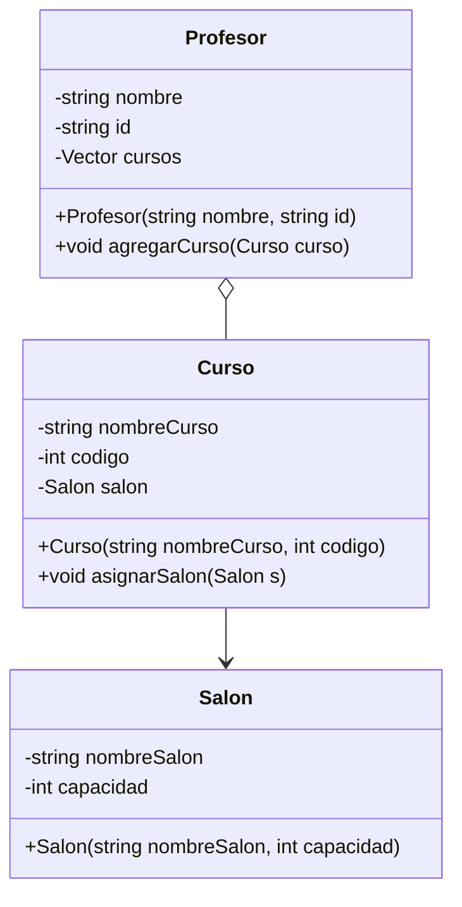

## Primer ejercicio de práctica POO ##

#### **Requisitos**
1. Implementa las clases `Persona` y `Automovil` siguiendo la estructura del diagrama de clases proporcionado.
2. Implementa los métodos constructores según lo especificado.
3. Implementa el método `agregarAutomovil(Automovil automovil)` en la clase `Persona`, el cual debe permitir asociar un automóvil a la persona.
4. Implementa el método `mostrarInfo()` en ambas clases, que debe imprimir los atributos de la instancia en la consola.
5. En el `main()`, realiza las siguientes acciones:
    - Crea al menos dos objetos de la clase `Persona` con diferentes nombres y edades.
    - Crea al menos dos objetos de la clase `Automovil` con diferentes marcas y años.
    - Asigna un automóvil a cada persona utilizando el método `agregarAutomovil`.
    - Llama al método `mostrarInfo()` de cada persona para visualizar sus datos y los de su automóvil.

#### **Ejemplo de Salida Esperada**
>Nombre: Juan Pérez Edad: 30 años Automóvil: Toyota, Año: 2020

>Nombre: María Gómez Edad: 25 años Automóvil: Ford, Año: 2018

