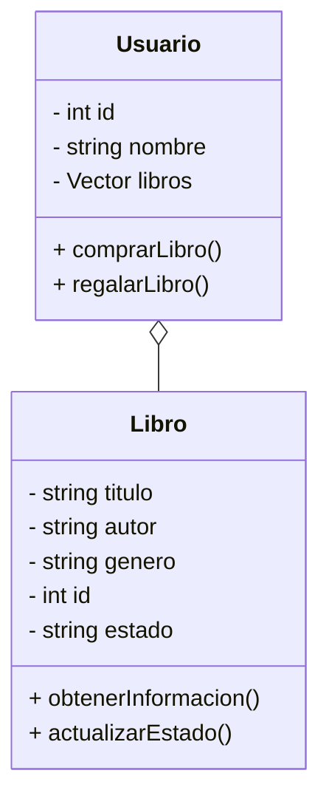

## Resolución ejercicio 2 ##

#### **Requisitos**
1. Implementa las clases `Libro` y `Usuario` siguiendo la estructura del diagrama de clases proporcionado.
2. Implementa los métodos constructores según lo especificado.
3. En la clase `Libro`, implementa:
    - Un método `obtenerInformacion()`, que imprima los atributos del libro en la consola.
    - Un método `actualizarEstado(string nuevoEstado)`, que actualice el estado del libro.
4. En la clase `Usuario`, implementa:
    - Un método `comprarLibro(Libro libro)`, que agregue un libro a la colección del usuario.
    - Un método `regalarLibro(int idLibro)`, que busque el libro de la colección y lo elimine
5. En el `main()`, realiza las siguientes acciones:
    - Crea al menos dos objetos de la clase `Usuario` con diferentes nombres e identificadores.
    - Crea al menos tres objetos de la clase `Libro` con diferentes títulos, autores y géneros.
    - Cada usuario debe comprar al menos dos libros.
    - Un usuario debe regalar un libro
    - Llama al método `obtenerInformacion()` de cada libro y muestra la lista de libros de regalarlos

#### **Ejemplo de Salida Esperada**
>Usuario: Carlos López ID: 101 Libros:
"1984" de George Orwell (Género: Distopía) - Estado: Nuevo
"El Principito" de Antoine de Saint-Exupéry (Género: Infantil) - Estado: Usado
Usuario: Ana Pérez ID: 102 Libros:
"Cien años de soledad" de Gabriel García Márquez (Género: Realismo mágico) - Estado: Nuevo
