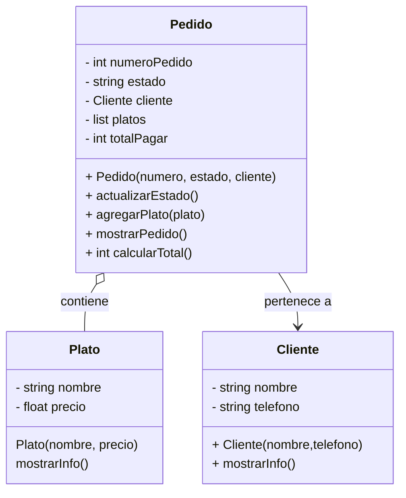

## Realización del tercer ejercicio ##

#### Instrucciones
1. Implementa las clases `Cliente`, `Pedido` y `Plato` siguiendo la estructura del diagrama de clases proporcionado.
2. En la clase `Plato`, implementa:
    - Un constructor que reciba el nombre del plato y su precio.
    - Un método `mostrarInfo()`, que imprima el nombre y precio del plato.
3. En la clase `Cliente`, implementa:
    - Un constructor que reciba el nombre y teléfono del cliente.
    - Un método `mostrarInfo()`, que imprima los datos del cliente.
4. En la clase `Pedido`, implementa:
    - Un constructor que reciba el número de pedido, el estado y el cliente asociado.
    - Un método `agregarPlato(Plato plato)`, que agregue platos al pedido.
    - Un método `mostrarPedido()`, que muestre el número de pedido, el estado, los datos del cliente y la lista de platos con sus precios.
    - Un método `totalPagar()` que retorne el valor total del pedido.
5. En el `main()`, realiza las siguientes acciones:
    - Crea al menos dos clientes con diferentes nombres y teléfonos.
    - Crea al menos tres platos con diferentes nombres y precios.
    - Crea al menos dos pedidos, asignando un cliente a cada uno y agregando platos a los pedidos.
    - Llama al método `mostrarPedido()` para visualizar la información de cada pedido.

## **Ejemplo de Salida Esperada**
> Pedido #1001 - Estado: En preparación Cliente: Juan Pérez - Teléfono: 123456789 Platos:

> Pizza Margarita - $25.50
> Ensalada César - $15.00 Total: $40.50

> Pedido #1002 - Estado: Entregado Cliente: Ana Gómez - Teléfono: 987654321 Platos:
>Pasta Alfredo - $22.00
>Tiramisú - $10.00 Total: $32.00
